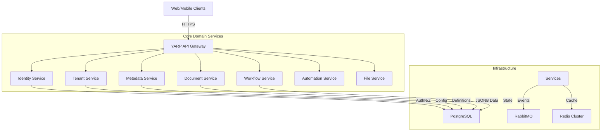

# Outclass Platform

Outclass is a production-grade, metadata-driven, multi-tenant low-code platform built with .NET 8, Next.js, and Cloud-Native technologies.

## Architecture

- **Microservices**: Identity, Tenant, Metadata, Document, Workflow, Automation, FileStorage.
- **Frontend**: Next.js 14 (App Router) with TypeScript and Tailwind CSS.
- **Gateway**: YARP Reverse Proxy.
- **Infrastructure**: PostgreSQL, Redis, RabbitMQ.
- **Communication**: Event-driven architecture using RabbitMQ and MassTransit stylistic patterns (raw RabbitMQ client implemented).

## Prerequisites

- [Docker Desktop](https://www.docker.com/products/docker-desktop/) or Docker Engine + Compose
- [.NET 10 SDK](https://dotnet.microsoft.com/download/dotnet/8.0) (for local development)
- [Node.js 24+](https://nodejs.org/) (for frontend)

## Getting Started

### 1. Start Infrastructure & Services

Run the entire platform using Docker Compose:

```bash
docker-compose up --build -d
```

This will start:
- Postgres (Port 5432)
- Redis (Port 6379)
- RabbitMQ (Port 5672, Management UI on 15672)
- All Microservices
- API Gateway (Port 5000)

**Note:** The databases passed to connection strings are automatically created by the `infra/init-db/01-create-dbs.sh` script mounted in the Postgres container.

### 2. Run Frontend

The frontend is located in `src/Web/Outclass.Web`.

```bash
cd src/Web/Outclass.Web
npm install
npm run dev
```

Access the frontend at `http://localhost:3000`.

### 3. Default Credentials

- **Admin User**: `admin@outclass.com`
- **Password**: `Admin123!`
- **System Tenant ID**: `11111111-1111-1111-1111-111111111111` (used for system admin)

### 4. API Documentation

You can access the individual service APIs directly if exposed, but all traffic should go through the Gateway at `http://localhost:5000`.

Endpoints:
- Identity: `http://localhost:5000/api/auth`
- Tenants: `http://localhost:5000/api/tenants`
- Metadata: `http://localhost:5000/api/entitydefinitions`
- Documents: `http://localhost:5000/api/documents`

## Development

### Building Backend

```bash
dotnet build
```

### Running Tests

```bash
dotnet test
```

## License

Proprietary - Outclass Platform.

---

# Outclass Platform Architecture Specification

**Version:** 1.0.0
**Status:** DRAFT
**Author:** Principal Architect Team
**Date:** February 17, 2026

---

## 1. Executive Summary

### 1.1 Platform Vision
Outclass is architected as a next-generation, metadata-driven SaaS platform designed to enable rapid application development and deployment within a multi-tenant ecosystem. By abstracting data models, workflows, and business logic into metadata, Outclass empowers organizations to build bespoke enterprise solutions without incurring the technical debt of custom software development.

### 1.2 Strategic Positioning
The platform addresses the convergence of enterprise control and low-code agility. Traditional SaaS is rigid; custom development is slow. Outclass bridges this gap by offering a fully programmable, event-driven infrastructure that treats "application logic" as data, scalable horizontally across thousands of tenants.

### 1.3 Long-Term Goal
To become the definitive operating system for enterprise business processes, supporting an ecosystem where metadata definitions are the primary unit of value exchange, capable of handling petabyte-scale data ingestion and millisecond-latency event processing.

---

## 2. System Overview

### 2.1 High-Level Architecture
Outclass utilizes a **Microservices Architecture** orchestrated via a centralized **API Gateway** (YARP). The system is composed of localized bounded contexts (Identity, Tenant, Metadata, Document, Workflow, Automation, File) that communicate asynchronously via an **Event Bus** (RabbitMQ) for eventual consistency and decoupling.

**Architecture Diagram (Conceptual)**



### 2.2 Design Philosophy
The system prioritizes **Isolation over Convenience**. Microservices share no database tables. All inter-service communication occurs via well-defined APIs (synchronous read) or Integration Events (asynchronous write/react). This ensures that individual components can evolve, scale, and fail independently.

---

## 3. Architectural Principles

### 3.1 Microservices-First
Decomposition of the domain into autonomous services prevents the monolithic "big ball of mud." Each service encapsulates a specific business capability (e.g., "Manage Identity," "Execute Workflow").

### 3.2 Bounded Contexts
Strict adherence to Domain-Driven Design (DDD). The concept of a "User" in the *Identity Service* (auth credentials) is distinct from a "User" in the *Workflow Service* (actor in a process).

### 3.3 Event-Driven Communication
Write operations enabling cross-context side effects MUST be asynchronous. This decoupling is enforcing via the **Outbox Pattern** to guarantee atomic persistence and event publication.

### 3.4 Database-Per-Service
To ensure loose coupling, every microservice owns its private database schema. Direct database access across service boundaries is strictly prohibited.

### 3.5 Multi-Tenancy Enforcement
Multi-tenancy is enforced at the **Middleware Layer** (Identity Injection) and the **Data Layer** (Row-Level Security / Discriminator Columns). This "Defense in Depth" strategy prevents data leakage.

### 3.6 Observability-First
No service is deployed without structured logging, distributed tracing (OpenTelemetry), and health checks. "If you can't measure it, you can't manage it" is a core tenet.

---

## 4. Microservices Breakdown

### 4.1 Identity Service
- **Responsibility:** Authentication (AuthN), Token Issuance (JWT), and User/Role Management.
- **Owned Data:** Users, Roles, Permissions, Refresh Tokens.
- **Exposed APIs:** `/api/auth/login`, `/api/auth/register`, `/api/auth/refresh`.
- **Published Events:** `UserCreated`, `UserRoleAssigned`.

### 4.2 Tenant Service
- **Responsibility:** Lifecycle management of tenants (Organization accounts).
- **Owned Data:** Tenants, Subscription Plans, Tenant Settings.
- **Published Events:** `TenantCreated`, `TenantSuspended`, `TenantPlanUpdated`.

### 4.3 Metadata Service
- **Responsibility:** Definition of dynamic entity structures (Schemas) and fields.
- **Owned Data:** EntityDefinitions, FieldDefinitions.
- **Scaling:** High-read, low-write. heavy caching via Redis.

### 4.4 Document Service
- **Responsibility:** Storage and retrieval of dynamic data instances based on Metadata definitions.
- **Owned Data:** DynamicDocuments (JSONB).
- **Extensibility:** Supports versioning and soft-deletes natively.

### 4.5 Workflow Service
- **Responsibility:** State machine execution engine. Manages transition logic and process history.
- **Owned Data:** WorkflowDefinitions, WorkflowInstances, TransitionHistory.
- **Consumed Events:** `DocumentStatusChanged` (triggers transitions).

### 4.6 Automation Service
- **Responsibility:** Rule-based background processing triggered by system events.
- **Owned Data:** AutomationRules, TriggerDefinitions, ExecutionLogs.
- **Pattern:** Consumes all integration events; evaluates rules; dispatches commands.

### 4.7 File Service
- **Responsibility:** Binary object storage management (S3/Local abstraction).
- **Owned Data:** FileMetadata, Blobs (reference).

### 4.8 API Gateway (YARP)
- **Responsibility:** L7 Routing, SSL Termination, Rate Limiting, Request Correlation Injection.
- **Owned Data:** None (Stateless).

---

## 5. Data Architecture

### 5.1 Database-Per-Service
We utilize **PostgreSQL 16+** as the primary persistence store. Each service connects to a dedicated logical database (e.g., `outclass_identity`, `outclass_tenant`).

### 5.2 JSONB Strategy for Dynamic Entities
The Document Service utilizes PostgreSQL's `JSONB` column type to store schemaless data, allowing runtime definition of fields without DDL changes, while maintaining potential for GIN indexing on specific JSON paths.

### 5.3 Tenant Isolation Model
All tables include a `TenantId` (GUID) column.
- **Write Path:** Application-layer validation ensures `TenantId` is injected from the authenticated context.
- **Read Path:** Global Query Filters in EF Core automatically append `WHERE TenantId = @CurrentTenantId` to all queries.

### 5.4 Outbox Pattern
To guarantee eventual consistency, modifying data and publishing an event is an atomic transaction.
1. Application transaction starts.
2. Entity state is updated.
3. Event is serialized and written to `OutboxMessages` table in the *same* transaction.
4. Transaction commits.
5. Background worker (CDC or Polling) publishes `OutboxMessages` to RabbitMQ.

---

## 6. Event-Driven Architecture

### 6.1 Event Bus
**RabbitMQ** is the backbone. We use a **Topic Exchange** (`outclass.events`) allowing services to subscribe to specific routing keys (e.g., `identity.user.created`).

### 6.2 Idempotency
Consumers must handle duplicate message delivery.
- **Pattern:** Trace `EventId`. Check `ProcessedEvents` table before execution.
- **Recovery:** If processing fails, the message is NACK'd and retried with exponential backoff.

### 6.3 Failure Recovery
Events that fail processing after maximum retries are routed to a **Dead Letter Queue (DLQ)** for human inspection and manual replay.

---

## 7. Multi-Tenancy Model

### 7.1 Tenant Resolution
1. **Gateway Layer:** Identifies tenant via `X-Tenant-Id` header or subdomain (future).
2. **Context Layer:** Middleware validates the existence of the tenant and injects `ITenantContext` into the DI container.

### 7.2 Data Partitioning (Shared Database)
Current implementations use **Discriminator-based** partitioning (Shared Database, Shared Schema).
- **Pros:** Operational simplicity, efficient resource usage.
- **Cons:** "Noisy neighbor" risk.

### 7.3 Future Enterprise Isolation
The architecture supports upgrading premium tenants to **Database-per-Tenant** isolation by changing the connection string resolution logic in the Repository layer, without rewriting business logic.

---

## 8. Security Architecture

### 8.1 Authentication flow
Standard **OAuth 2.0 / OIDC** flows.
1. Client requests token from Identity Service.
2. Identity Service validates credentials and issues signed **JWT (Access Token)** and **Refresh Token**.
3. Gateway validates JWT signature at the edge.

### 8.2 Role-Based Authorization (RBAC)
Permissions are embedded in JWTs as `claims`.
- **Service-Level:** `[Authorize(Roles = "Admin")]`
- **Resource-Level:** Logic checks `User.HasPermission("document.write")`.

### 8.3 Service-to-Service Authentication
Internal traffic is secured via mTLS (infrastructure) or Client Credentials (application level) to ensure zero-trust networking.

---

## 9. Frontend Architecture

### 9.1 Metadata-Driven Rendering
The Next.js frontend retrieves `EntityDefinitions` from the Metadata Service and dynamically generates form layouts and data grids.
- **Advantage:** New fields logic added by admins appear instantly without redeployment.

### 9.2 State Management
- **Server State:** Handled via React Query / SWR (stale-while-revalidate).
- **UI State:** Local React Context or Zustand.

### 9.3 Tenant-Aware Routing
All frontend routes (except public/system) are protected by a `TenantGuard` which ensures a valid tenant context is active before loading distinct modules.

---

## 10. Observability & Monitoring

### 10.1 Distributed Tracing
**OpenTelemetry** is instrumented in every service. A strict `TraceId` propagation policy ensures a request can be tracked from Nginx -> Gateway -> Identity -> Database.

### 10.2 Structured Logging
Logs are structured (JSON) utilizing **Serilog**. They include correlation IDs, Tenant IDs, and Environment data, ingestible by ELK or Seq.

### 10.3 Health Checks
`/health` and `/ready` endpoints expose the status of the service and its dependencies (DB, Redis, RabbitMQ) for the container orchestrator.

---

## 11. Deployment Architecture

### 11.1 Container Strategy
Docker containers are stateless and immutable. Configuration is injected via Environment Variables (`ASPNETCORE_ENVIRONMENT`, `ConnectionStrings__*`).

### 11.2 Horizontal Scaling
Services are designed to be run as `ReplicaSets`.
- **State:** No sticky sessions. State is offloaded to Redis/Postgres.
- **Workers:** Background workers use distributed locking (Redis) to prevent race conditions when multiple instances run.

### 11.3 CI/CD Pipeline (Design)
- **Build:** Parallel builds of Docker images.
- **Test:** Unit tests run in isolation; Integration tests run against ephemeral containers (Testcontainers).
- **Push:** Semantic version tagging.
- **Deploy:** Helm charts update Kubernetes manifests.

---

## 12. Non-Functional Requirements

- **Scalability:** System must support 10,000+ concurrent tenants per cluster.
- **Performance:** P95 API latency < 200ms for core read operations.
- **Data Durability:** RPO (Recovery Point Objective) < 5 minutes (WAL archiving).
- **Availability:** 99.9% uptime uptime SLA.

---

## 13. Scalability Strategy

### 13.1 Service-Level Scaling
Compute is cheap. We utilize Kubernetes HPA (Horizontal Pod Autoscaling) based on CPU/Memory/Request metrics.

### 13.2 Database Scaling
- **Read Replicas:** CQRS queries can be offloaded to read-only replicas.
- **Sharding:** Future roadmap includes consistent hashing to shard Tenant Data across multiple physical database clusters.

### 13.3 Caching
**Redis** serves as a 2nd-level cache. Aggressive caching of Metadata definitions is critical for performance.

---

## 14. Development Guidelines

### 14.1 Git Workflow
Trunk-Based Development. Short-lived feature branches merged via Pull Request.

### 14.2 Commit Discipline
Conventional Commits standard (`feat:`, `fix:`, `chore:`) to automate changelog generation.

### 14.3 API Versioning
All public APIs must be versioned (`/api/v1/...`). Breaking changes require a new version or content negotiation strategy.

---

## 15. Risk Assessment

| Risk | Impact | Mitigation Strategy |
|------|--------|---------------------|
| **Distributed Transactions** | Data Inconsistency | Implement Sagas and Eventual Consistency (Outbox). |
| **Tenant Data Leak** | Critical Security Failure | Enforce TenantID filters at global DB context level; comprehensive unit testing of filters. |
| **System Complexity** | Developer friction | Extensive documentation; SDKs; Local development containerization. |

---

## 16. Technical Roadmap (3-Year)

### Phase 1: Core Platform (Months 0-6)
Establish Identity triggers, Dynamic Schema engine, Basic Workflow transitions, and deployment pipelines.

### Phase 2: Enterprise Features (Months 6-12)
SSO/SAML integration, Audit Log export, Database-per-tenant option, Advanced Analytics.

### Phase 3: Ecosystem (Year 2)
Marketplace for "Solution Templates", Public API SDKs, Webhooks system, Mobile layout rendering.

### Phase 4: Intelligence (Year 3)
AI-assisted workflow generation, Predictive analytics on tenant data, Natural Language querying.
